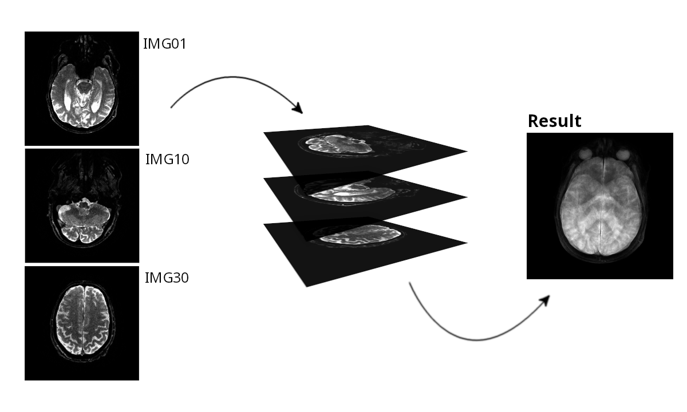
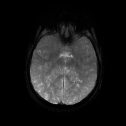
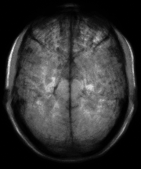
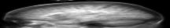
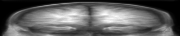
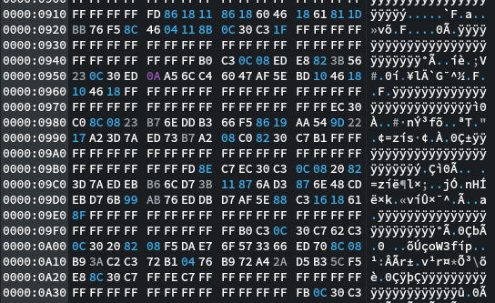

# ProyeccionesEDD
Proyecto final 'Estructuras de datos' 2022-01\
Pontificia Univerisdad Javeriana

## Proyecciones 2D
Esta funcionalidad tiene como objetivo crear un volumen 3D a partir de una serie de representaciones 2D.\
Toma cada una de las imágenes y las coloca una encima de otra en órden para formar un volumen, luego se proyecta el volumen en una dirección específica (x, y o z) y con un criterio específico (promedio, media, mediana) para nuevamente obtener una imágen 2D en una perspectiva diferente.

Estas proyecciones se pueden dirigir en cualquier dirección, en esta tabla se muestran algunos ejemplos:
<table>
	<tr>
		<th>Dirección</th>
		<th>IM-126-0002-epiT2</th>
		<th>t1_icbm_5mm_</th>
	</tr>
	<tr>
		<th>X</th>
		<td></td>
		<td></td>
	</tr>
	<tr>
		<th>Y</th>
		<td></td>
		<td></td>
	</tr>
	<tr>
		<th>Z</th>
		<td></td>
		<td></td>
	</tr>
</table>

## Codificación de Huffman
Esta funcionalidad tiene como objetivo comprimir los datos de una imágen en formato PGM mediante la utilización de un Árbol de [Codificación Huffman](https://es.wikipedia.org/wiki/Codificaci%C3%B3n_Huffman)

El árbol de Huffman resulta en un método de compresión rápido y eficiente como lo muestra el siguiente experimento:

| Archivo                | Peso    |
| ---------------------- | ------- |
| __proyection.pgm__     | 163.8kB |
| __compressed.huffman__ | 37.3kb  |

Compresión del __77.2%__ del archivo en __0.065ms__

Este es el resultado de comprimir una imagen mediante el árbol de codificación de Huffman, un archivo binario con la información en bits de cada uno de los caractéres que conforma el archivo original:

## Segmentación
El algoritmo de segmentación requiere crear un grafo donda cada uno de los píxeles de la imagen corresponde a un nodo, luego se evalúa el [Algoritmo de Dijkstra](https://en.wikipedia.org/wiki/Dijkstra%27s_algorithm) para hallar los caminos más cortos hacia otros nodos

Este procedimiento tiene como resultado la identificación de patrones y formas dentro de las imágenes, como por ejemplo esta imágen de Mario, en la cual colocamos tres semillas, una en cada bota y otra en la cabeza

Como resultado obtenemos la imágen segmentada que nos permite obtener cada uno de los grupos de píxeles de manera independiente